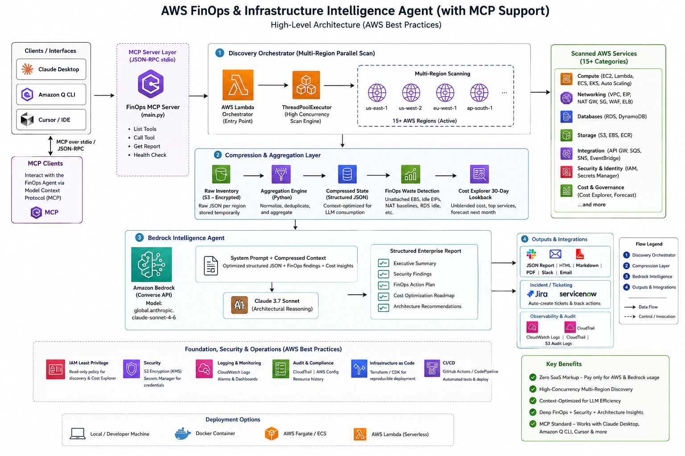

# AWS FinOps & Infrastructure Intelligence Agent

An autonomous AWS infrastructure discovery, FinOps, security posture, and architectural intelligence agent powered by Amazon Bedrock, Claude, Bedrock AgentCore, and Model Context Protocol (MCP).

The system discovers AWS infrastructure across regions, performs deterministic FinOps and security analysis, compresses infrastructure context, and uses an LLM for architectural reasoning and enterprise reporting.



The resulting compact infrastructure state is then passed to the intelligence layer for architectural reasoning.

---
# Key Capabilities

## Multi-Region AWS Discovery

Scans active AWS regions concurrently using Python's `ThreadPoolExecutor`.

## FinOps Waste Detection

Identifies potential sources of unnecessary cloud expenditure, including:

- Unattached EBS volumes

- Unassociated Elastic IPs

- NAT Gateway baseline costs

- Stopped EC2 instances

- Potentially idle infrastructure

- Legacy database engines

- High-cost AWS services

## AWS Cost Analysis

Integrates with AWS Cost Explorer to retrieve:

- 30-day historical spend

- Unblended cost

- Top AWS services by spend

- Cost forecasting

## Security Posture Analysis

Identifies infrastructure security signals such as:

- `0.0.0.0/0` SSH access

- `0.0.0.0/0` RDP access

- WAF deployment coverage

- IAM inventory

- Potentially exposed infrastructure

- Legacy RDS engines

## Architectural Intelligence

The LLM analyzes discovered infrastructure to identify:

- Architecture patterns

- Scalability concerns

- Security concerns

- Networking patterns

- Modernization opportunities

- Potential optimization opportunities

## Context Optimization

Raw AWS inventory is aggregated and compressed before being sent to the model.

This significantly reduces unnecessary context consumption.

## MCP Support

The agent can be exposed through MCP-compatible clients such as:

- Claude Desktop

- Cursor

- Amazon Q CLI

- Other MCP-compatible applications

---
# Architecture

The complete architecture is available in:

```text

FinOps_architecture.png

The architecture diagram represents the complete flow from AWS infrastructure discovery through deterministic analysis, context compression, Bedrock intelligence, and final enterprise audit generation.

---
# Architecture Workflow

The system follows the following logical pipeline:

AWS Environment

      │

      ▼

Multi-Region Discovery

      │

      ▼

Resource Inventory

      │

      ▼

Normalization

      │

      ▼

Context Compression

      │

      ├── FinOps Waste Detection

      ├── Cost Analysis

      ├── Security Analysis

      └── Architecture Signals

      │

      ▼

Compact Structured Context

      │

      ▼

Amazon Bedrock / Claude

      │

      ▼

Enterprise Intelligence Report

      │

      ├── Executive Summary

      ├── FinOps Findings

      ├── Security Findings

      ├── Architecture Assessment

      ├── Estimated Savings

      └── Prioritized Action Plan

---
# Official AWS FinOps Agent vs Custom Agent

This project is designed as a **custom infrastructure intelligence engine**, rather than simply reproducing a managed FinOps experience.

| Capability / Dimension | Official AWS FinOps Agent | This Agent |
|---|---|---|
| Execution Architecture | Managed AWS service experience | Custom Python engine |
| Runtime | AWS-managed | Bedrock AgentCore / local / container |
| Discovery Model | Primarily billing and optimization oriented | Resource-level infrastructure discovery |
| Multi-Region Discovery | Managed capability | Explicit concurrent scanning |
| Resource Inspection | Managed service capabilities | Direct AWS API inspection |
| FinOps | Cost and optimization analysis | Cost + infrastructure waste detection |
| Security | FinOps-oriented | FinOps + security posture |
| Context Strategy | AWS-managed | Custom deterministic compression |
| Model | Managed routing | Configurable Amazon Bedrock model |
| Extensibility | Service-defined | Fully customizable Python architecture |
| MCP | Not the primary architecture | First-class MCP integration |
| IDE Integration | Depends on AWS-supported interfaces | MCP-compatible clients |
| AWS Service Coverage | Managed capability set | Extensible custom scanner |
| Deployment Control | AWS-managed | Full customer control |
| Output Format | Service-defined | Fully customizable |
| Security Rules | Managed | Custom rules |
| Waste Rules | Managed | Custom heuristics |
| Architecture Reasoning | Managed capability | Custom architectural reasoning |
| Multi-Account Extension | Capability dependent | STS AssumeRole based architecture |
| Remediation | Service-dependent | Can be implemented with explicit approval |
| Pricing Model | AWS service pricing + API usage | AWS API + Bedrock consumption |

> **Important:** This comparison describes the architectural design philosophy of this project. AWS managed services and capabilities evolve over time, so specific feature comparisons should be validated against the current AWS service documentation.

---
# Discovery Engine

The discovery engine performs direct inspection of AWS resources.

Typical discovery modules include:

EC2

EBS

Elastic IP

VPC

Route Tables

Security Groups

NAT Gateway

RDS

Lambda

ECS

EKS

Auto Scaling

S3

DynamoDB

ECR

API Gateway

SQS

SNS

EventBridge

IAM

Secrets Manager

WAFv2

Elastic Load Balancing

CloudFront

Cost Explorer

The discovery process normalizes AWS API responses into a common internal representation.

Example:

{

  "service": "ec2",

  "region": "us-east-1",

  "resources": []

}

This makes downstream aggregation independent of individual AWS API response formats.

---
# Multi-Region Discovery

AWS infrastructure is commonly distributed across multiple regions.

The agent therefore performs concurrent discovery.

Example implementation:

from concurrent.futures import ThreadPoolExecutor

with ThreadPoolExecutor(max_workers=50) as executor:

futures = [

executor.submit(scan_region, region)

for region in regions

    ]

results = [

future.result()

for future in futures

    ]

The default worker count can be adjusted depending on:

-  AWS API rate limits
-  Number of regions
-  Number of resources
-  Execution environment
-  Retry configuration

A production deployment should implement appropriate retry and throttling controls.

---
# Global Services

Some AWS services require account-level or global handling instead of being treated purely as regional resources.

Examples include:

-  IAM
-  CloudFront
-  Cost Explorer
-  S3 bucket inventory

The architecture therefore separates regional discovery from global discovery where appropriate.

---
# Context Compression Layer

One of the most important components of this architecture is the **context compression layer**.

Large AWS environments can generate extremely large API responses.

For example:

Thousands of EC2 instances

Hundreds of security groups

Hundreds of Lambda functions

Hundreds of databases

Thousands of network resources

Sending every raw API response to an LLM would:

-  Increase token consumption
-  Increase latency
-  Reduce useful context density
-  Increase the possibility of context-window exhaustion
-  Make reasoning more difficult

The compression layer solves this by transforming raw infrastructure into meaningful signals.

---
# Compression Pipeline

Raw AWS Inventory

       │

       ▼

Normalization

       │

       ▼

Aggregation

       │

       ▼

Waste Detection

       │

       ▼

Security Signal Extraction

       │

       ▼

Cost Aggregation

       │

       ▼

Compact Structured JSON

Example raw data:

{

  "volumes": [

    {

      "VolumeId": "vol-001",

      "Size": 100,

      "State": "available"

    },

    {

      "VolumeId": "vol-002",

      "Size": 200,

      "State": "in-use"

    }

  ]

}

Compressed representation:

{

  "ebs": {

    "total_volumes": 2,

    "unattached_volumes": 1,

    "unattached_storage_gb": 100

  }

}

The model receives the information necessary for reasoning without unnecessary API payload noise.

---
# FinOps Intelligence

The FinOps engine combines:

AWS Cost Data

+

Resource Inventory

+

Waste Detection

+

Infrastructure Signals

This produces a more actionable analysis than simply looking at billing data.

---
# Unattached EBS Volumes

An EBS volume in the `available` state may no longer be attached to an EC2 instance.

Example:

{

  "finding": "UNATTACHED_EBS",

  "count": 4,

  "estimated_monthly_savings": 20

}

The actual savings depend on:

-  Volume type
-  Volume size
-  Region
-  Pricing model
-  Storage duration

Therefore, fixed values such as `$5/volume/month` should be treated as illustrative estimates.

---
# Unassociated Elastic IPs

The agent can detect Elastic IP addresses that are not associated with active resources.

Example:

{

  "finding": "UNASSOCIATED_ELASTIC_IP",

  "count": 2

}

Actual pricing should be calculated according to the current AWS pricing applicable to the resource and region.

---
# NAT Gateway Analysis

NAT Gateways can generate:

1.  Hourly gateway charges
2.  Data processing charges

The agent can calculate a baseline estimate based on the number of NAT Gateways.

Example:

{

  "nat_gateways": 3,

  "baseline_monthly_estimate": 97.20

}

This is a simplified baseline and does not necessarily represent the final monthly NAT Gateway bill.

A production FinOps implementation should account for:

-  Region
-  NAT Gateway hours
-  Data processed
-  Traffic patterns
-  Architecture alternatives

---
# AWS Cost Explorer

The agent can retrieve:

-  30-day historical cost
-  Unblended cost
-  Top services by spend
-  Forecast information

Example:

{

  "cost": {

    "lookback_days": 30,

    "total_unblended_cost": 12450.73,

    "top_services": [

      {

        "service": "Amazon Elastic Compute Cloud",

        "cost": 4250.32

      }

    ]

  }

}

---
# Security Intelligence

The security analysis layer identifies infrastructure configuration signals.

It can inspect:

-  Security Groups
-  WAF
-  IAM
-  Secrets Manager
-  Public administrative ports
-  RDS engine versions
-  Public-facing resources

---
# Public Administrative Ports

The agent can identify rules such as:

0.0.0.0/0 → TCP/22

0.0.0.0/0 → TCP/3389

Example:

{

  "finding": "PUBLIC_ADMIN_PORT",

  "port": 22,

  "cidr": "0.0.0.0/0",

  "severity": "HIGH"

}

These findings should be validated against the organization's architecture.

For example, a public SSH rule may be intentionally deployed in a controlled environment, although it should generally be reviewed carefully.

---
# WAF Analysis

The agent can inspect WAFv2 Web ACL deployments.

Example:

{

  "waf": {

    "regional_web_acls": 3,

    "cloudfront_web_acls": 1

  }

}

The intelligence layer can reason about:

-  Internet-facing workloads
-  WAF coverage
-  Edge protection
-  Regional application protection
-  Potential gaps

---
# Auto Scaling Analysis

The agent can inspect Auto Scaling Groups and associated capacity configuration.

Signals include:

Desired Capacity

Minimum Capacity

Maximum Capacity

Instance Counts

Scaling Configuration

This helps identify infrastructure that may be:

-  Over-provisioned
-  Under-scaled
-  Static
-  Missing elasticity

---
# RDS Intelligence

The agent can inspect:

-  RDS instances
-  Database engines
-  Engine distribution
-  Region distribution

Example:

{

  "rds": {

    "total": 14,

    "engines": {

      "postgres": 8,

      "mysql": 4,

      "oracle": 2

    }

  }

}

The model can use this information to identify:

-  Legacy engines
-  Modernization opportunities
-  Database concentration
-  Potential architecture concerns

---
# Architectural Intelligence

The agent goes beyond resource inventory.

It attempts to reason about relationships between infrastructure components.

For example:

Internet

   ↓

CloudFront

   ↓

WAF

   ↓

Load Balancer

   ↓

Compute

   ↓

Database

The model can evaluate:

-  Network architecture
-  Security boundaries
-  Scalability
-  Resilience
-  Public exposure
-  Service relationships
-  Modernization opportunities

The objective is to understand the **architecture represented by the discovered AWS state**.

---
# Amazon Bedrock Intelligence Layer

The system separates deterministic infrastructure analysis from generative reasoning.

Deterministic code handles:

-  Counting
-  Aggregation
-  Resource-state classification
-  Waste detection
-  Basic cost calculations
-  Security rule detection

The LLM handles:

-  Interpretation
-  Prioritization
-  Architecture reasoning
-  Recommendation generation
-  Executive summarization

This creates the following model:

AWS APIs

   ↓

Deterministic Analysis

   ↓

Compressed Context

   ↓

Amazon Bedrock

   ↓

LLM Reasoning

---
# Model Configuration

The implementation can use a Claude model available through Amazon Bedrock.

Example:

global.anthropic.claude-sonnet-4-6

Recommended configuration:

BEDROCK_MODEL_ID=global.anthropic.claude-sonnet-4-6

The model identifier should remain configurable because Bedrock model availability and identifiers can change by region and inference configuration.

---
# Model Context Protocol

The agent supports the **Model Context Protocol (MCP)**.

MCP allows the infrastructure intelligence engine to be consumed by compatible AI clients.

Supported use cases include:

-  Conversational AWS audits
-  Interactive FinOps analysis
-  Security investigation
-  Architecture analysis
-  Infrastructure troubleshooting

---
# MCP Architecture

The MCP layer acts as an interoperability interface:

MCP Client

   │

   ├── Claude Desktop

   ├── Cursor

   ├── Amazon Q CLI

   └── Other MCP Clients

   │

   ▼

AWS FinOps MCP Server

   │

   ▼

Discovery Engine

   │

   ▼

Compression + Analysis

   │

   ▼

Amazon Bedrock

   │

   ▼

Enterprise Audit

---
# MCP Client Integration

## Claude Desktop

Claude Desktop can launch the local MCP server directly.

## Cursor

Cursor can use the MCP server to access AWS infrastructure intelligence while working on infrastructure or application code.

## Amazon Q CLI

The MCP interface can provide cloud intelligence capabilities within CLI-based workflows where supported.

---
# Claude Desktop Configuration

Claude Desktop configuration locations:

### Windows

%APPDATA%\Claude\claude_desktop_config.json

### macOS

~/Library/Application Support/Claude/claude_desktop_config.json

Example:

{

  "mcpServers": {

    "aws-finops-agent": {

      "command": "python",

      "args": [

"D:\\\AWS_agent_template\\\AWS_FinOps_Agent\\\main.py"

      ],

      "env": {

        "AWS_REGION": "us-east-1",

        "AWS_PROFILE": "default"

      }

    }

  }

}

After modifying the configuration, restart the MCP client.

---
# AWS Billing MCP Integration

The architecture can also integrate a dedicated AWS billing/cost-management MCP server.

Example:

{

  "mcpServers": {

    "aws-finops-agent": {

      "command": "python",

      "args": [

"D:\\\AWS_agent_template\\\AWS_FinOps_Agent\\\main.py"

      ],

      "env": {

        "AWS_REGION": "us-east-1",

        "AWS_PROFILE": "default"

      }

    },

    "aws-billing-cost-management": {

      "command": "uvx",

      "args": [

"billing-cost-management-mcp-server"

      ],

      "env": {

        "AWS_REGION": "us-east-1"

      }

    }

  }

}

The billing MCP server must be installed and configured according to its own distribution requirements.

---
# Example MCP Prompts

Once configured, users can interact with the agent using natural language.

### Complete Audit

Audit my AWS environment and identify the highest-priority FinOps and security issues.

### Waste Detection

Find all potentially unused AWS resources and estimate the monthly savings opportunity.

### Security

Find publicly accessible SSH and RDP ports across my AWS environment.

### Cost

What are my top AWS services by spend over the last 30 days?

### NAT Gateway

Analyze my NAT Gateway deployment and estimate the baseline monthly cost.

### RDS

Review my RDS engines and identify potential modernization opportunities.

### Architecture

Analyze my AWS infrastructure and provide an architecture assessment.

---
# Services Scanned

## Compute

| AWS ServiceDiscovery |                            |
| -------------------- | -------------------------- |
| EC2                  | Instances, states, regions |
| Auto Scaling         | Groups and capacity        |
| Lambda               | Functions                  |
| ECS                  | Clusters                   |
| EKS                  | Clusters                   |

## Networking & Security

| AWS ServiceDiscovery |                                  |
| -------------------- | -------------------------------- |
| VPC                  | VPC inventory                    |
| EC2 Networking       | Route tables                     |
| NAT Gateway          | Gateway count and baseline       |
| Elastic IP           | Association state                |
| Security Groups      | Public administrative access     |
| WAFv2                | Regional and CloudFront Web ACLs |
| ELBv2                | Load Balancers                   |
| CloudFront           | Distributions                    |

## Databases & Storage

| AWS ServiceDiscovery |                              |
| -------------------- | ---------------------------- |
| RDS                  | Instances and engines        |
| DynamoDB             | Tables                       |
| S3                   | Buckets                      |
| EBS                  | Volumes and attachment state |
| ECR                  | Repositories                 |

## Integration & Events

| AWS ServiceDiscovery |           |
| -------------------- | --------- |
| API Gateway          | REST APIs |
| SQS                  | Queues    |
| SNS                  | Topics    |
| EventBridge          | Rules     |

## Security & Identity

| AWS ServiceDiscovery |                  |
| -------------------- | ---------------- |
| IAM                  | Users            |
| IAM                  | Roles            |
| Secrets Manager      | Secrets          |
| WAFv2                | Web ACLs         |
| Security Groups      | Ingress exposure |

## Cost & Governance

| CapabilityAnalysis |                           |
| ------------------ | ------------------------- |
| Cost Explorer      | 30-day historical spend   |
| Cost Explorer      | Unblended cost            |
| Cost Explorer      | Top services              |
| Cost Explorer      | Forecast                  |
| FinOps Engine      | Waste detection           |
| Compression Layer  | Cost context optimization |

---
# IAM Permissions

The agent should use a read-only IAM identity wherever possible.

Baseline policy:

{

  "Version": "2012-10-17",

  "Statement": [

    {

      "Sid": "FinOpsCostExplorerRead",

      "Effect": "Allow",

      "Action": [

"ce:GetCostAndUsage",

"ce:GetCostForecast"

      ],

      "Resource": "*"

    },

    {

      "Sid": "MultiRegionDiscoveryRead",

      "Effect": "Allow",

      "Action": [

"ec2:Describe*",

"rds:DescribeDBInstances",

"elasticloadbalancing:DescribeLoadBalancers",

"lambda:ListFunctions",

"dynamodb:ListTables",

"ecr:DescribeRepositories",

"apigateway:GET",

"ecs:ListClusters",

"eks:ListClusters",

"autoscaling:DescribeAutoScalingGroups",

"secretsmanager:ListSecrets",

"wafv2:ListWebACLs",

"sqs:ListQueues",

"sns:ListTopics",

"events:ListRules",

"s3:ListAllMyBuckets",

"iam:ListUsers",

"iam:ListRoles",

"cloudfront:ListDistributions"

      ],

      "Resource": "*"

    },

    {

      "Sid": "BedrockInvokePermissions",

      "Effect": "Allow",

      "Action": [

"bedrock:InvokeModel"

      ],

      "Resource": "*"

    }

  ]

}

> **Production note:** Bedrock resource-level permissions should be scoped to the exact model or inference profile used by the implementation. Cross-region inference configurations may require different ARN patterns.

Additional permissions may be required as new scanners are added.

---
# Security Model

The recommended security model is:

Least Privilege

      ↓

Read-Only IAM

      ↓

Discovery

      ↓

Analysis

      ↓

Recommendation

      ↓

Human Approval

      ↓

Optional Remediation

The initial agent should not automatically execute destructive operations.

It should not automatically:

-  Delete EBS volumes
-  Release Elastic IPs
-  Terminate EC2 instances
-  Delete NAT Gateways
-  Modify Security Groups
-  Modify IAM policies

Instead, it should produce recommendations.

---
# Data Flow

AWS APIs

   │

   ├── EC2

   ├── EBS

   ├── RDS

   ├── Lambda

   ├── VPC

   ├── NAT

   ├── EIP

   ├── WAF

   ├── IAM

   ├── S3

   └── Cost Explorer

        │

        ▼

Discovery Layer

        │

        ▼

Normalized Inventory

        │

        ▼

Compression Layer

        │

        ├── Cost Signals

        ├── Waste Signals

        ├── Security Signals

        └── Architecture Signals

        │

        ▼

Structured Context

        │

        ▼

Amazon Bedrock

        │

        ▼

Claude

        │

        ▼

Enterprise Cloud Audit

---
# Cost Intelligence

The agent combines:

Historical Cost

+

Forecast

+

Resource Inventory

+

Waste Detection

+

Infrastructure Context

Example:

Cost Explorer

    │

    └── EC2 = $4,250/month

Resource Discovery

    │

    ├── 120 EC2 instances

    ├── 18 stopped instances

    └── 11 potentially idle resources

FinOps Analysis

    │

    └── Optimization opportunity

Bedrock

    │

    └── Prioritized recommendation

This enables the agent to connect **financial information with actual infrastructure state**.

---
# Waste Detection

Current waste detection can include:

### EBS

-  Unattached volumes
-  Unused storage

### Elastic IP

-  Unassociated EIPs

### NAT Gateway

-  Gateway count
-  Baseline hourly cost
-  Potential architecture optimization

### EC2

-  Stopped instances
-  Potentially idle infrastructure

### RDS

-  Legacy engines
-  Potential modernization opportunities

Future extensions can include:

-  Idle load balancers
-  Old snapshots
-  Unused AMIs
-  ECR cleanup
-  DynamoDB optimization
-  Lambda optimization
-  Savings Plans coverage
-  Reserved Instance analysis
-  Compute Optimizer recommendations

---
# Security Findings

Example finding:

{

  "finding_id": "SEC-001",

  "category": "NETWORK",

  "resource_type": "SecurityGroup",

  "finding": "Administrative port publicly accessible",

  "port": 22,

  "cidr": "0.0.0.0/0",

  "severity": "HIGH",

  "recommendation": "Restrict SSH access using private networking, VPN, bastion, SSM, or approved source ranges."

}

Potential finding categories:

NETWORK

IAM

WAF

DATABASE

EXPOSURE

CONFIGURATION

---
# Output Schema

Recommended output:

{

  "sessionId": "uuid",

  "metadata": {

    "scan_timestamp": "2026-08-20T12:00:00Z",

    "regions_scanned": 8

  },

  "result": {

    "compressed_inventory": {},

    "finops_findings": [],

    "security_findings": [],

    "architectural_findings": [],

    "estimated_monthly_savings": 0,

    "architectural_report": ""

  }

}

---
# Example Output

{

  "sessionId": "b8f52b61-4874-45e2-a083-f5424564c781",

  "result": {

    "scan_timestamp": "2026-08-20T12:00:00Z",

    "compressed_inventory": {

      "aggregated_resources": {

        "compute": {

          "ec2_total": 12,

          "ec2_running": 8,

          "lambda": 45

        },

        "finops_waste": {

          "unattached_ebs": 4,

          "unused_eips": 2

        },

        "estimated_monthly_savings": 28

      }

    },

    "architectural_report": "### 1. Executive Summary\n...\n### 2. Critical Security Findings\n..."

  }

}

> The savings number is illustrative. Production savings should be calculated using current AWS pricing and resource-specific dimensions.

---
# Project Structure

A recommended structure:

AWS-FinOps-Agent/

│

├── main.py

├── requirements.txt

├── README.md

├── architecture.png

├── LICENSE

├── .gitignore

├── .env.example

│

├── agent/

│   ├── __init__.py

│   ├── bedrock_agent.py

│   ├── prompts.py

│   └── report_generator.py

│

├── discovery/

│   ├── __init__.py

│   ├── orchestrator.py

│   ├── regional_scanner.py

│   ├── global_scanner.py

│   ├── ec2.py

│   ├── rds.py

│   ├── vpc.py

│   ├── lambda_scanner.py

│   ├── s3.py

│   ├── dynamodb.py

│   ├── ecs.py

│   ├── eks.py

│   ├── waf.py

│   └── iam.py

│

├── finops/

│   ├── __init__.py

│   ├── waste_detector.py

│   ├── cost_explorer.py

│   └── pricing.py

│

├── security/

│   ├── __init__.py

│   ├── security_groups.py

│   ├── waf_analysis.py

│   └── posture.py

│

├── compression/

│   ├── __init__.py

│   ├── aggregator.py

│   └── context_optimizer.py

│

├── mcp/

│   ├── __init__.py

│   └── server.py

│

└── tests/

    ├── test_discovery.py

    ├── test_finops.py

    ├── test_security.py

    └── test_compression.py

If your actual repository has a different structure, update this section to match the implementation.

---
# Prerequisites

Before running the project, install:

-  Python 3.10+
-  AWS CLI
-  Git
-  AWS account
-  AWS credentials
-  Required IAM permissions
-  Amazon Bedrock model access
-  Optional MCP-compatible client

---
# Installation

## 1. Clone the Repository

git clone https://github.com/arunprasath403/AWS-FinOps-Agent.git

cd AWS-FinOps-Agent

---
## 2. Create Virtual Environment

### Windows PowerShell

python -m venv venv

.\venv\Scripts\Activate.ps1

### Linux / macOS

python3 -m venv venv

source venv/bin/activate

---
## 3. Install Dependencies

pip install -r requirements.txt

---
# AWS Configuration

Configure AWS credentials using the AWS CLI:

aws configure

Verify:

aws sts get-caller-identity

For a specific profile:

aws sts get-caller-identity --profile default

---
# Configure AWS Region

### Windows PowerShell

$env:AWS_REGION="us-east-1"

### Linux / macOS

export AWS_REGION="us-east-1"

Optional profile:

$env:AWS_PROFILE="default"

---
# Running Locally

Run:

python main.py

Expected workflow:

Initialize AWS Session

        ↓

Discover Regions

        ↓

Scan AWS Resources

        ↓

Retrieve Cost Data

        ↓

Compress Inventory

        ↓

Run FinOps Analysis

        ↓

Run Security Analysis

        ↓

Invoke Bedrock

        ↓

Generate Audit

---
# Running with MCP

If `main.py` exposes the MCP server, configure the MCP client to execute it.

Example:

{

  "mcpServers": {

    "aws-finops-agent": {

      "command": "python",

      "args": [

"D:\\\AWS_agent_template\\\AWS_FinOps_Agent\\\main.py"

      ],

      "env": {

        "AWS_REGION": "us-east-1",

        "AWS_PROFILE": "default"

      }

    }

  }

}

Restart the MCP client after changing its configuration.

---
# Environment Variables

Recommended environment variables:

AWS_REGION=us-east-1

AWS_PROFILE=default

BEDROCK_MODEL_ID=global.anthropic.claude-sonnet-4-6

MAX_WORKERS=50

COST_LOOKBACK_DAYS=30

LOG_LEVEL=INFO

Additional configuration can include:

BEDROCK_MAX_TOKENS

BEDROCK_TEMPERATURE

AWS_API_TIMEOUT

AWS_MAX_RETRIES

MAX_REGIONS

---
# Production Deployment

The agent can run in multiple deployment models.

## Local

Developer Machine

      ↓

Python

      ↓

AWS APIs

      ↓

Amazon Bedrock

Suitable for:

-  Development
-  Testing
-  POCs
-  MCP workflows

---
## Container

Docker

   ↓

Container Runtime

   ↓

Discovery Engine

   ↓

AWS APIs

   ↓

Bedrock

Suitable for:

-  CI/CD
-  Scheduled scanning
-  Repeatable execution
-  Controlled dependencies

---
## Bedrock AgentCore

The custom intelligence engine can be deployed using Bedrock AgentCore as the agent runtime layer.

Conceptually:

MCP / API / Client

       ↓

AgentCore Runtime

       ↓

Custom FinOps Agent

       ↓

Discovery Engine

       ↓

AWS APIs

       ↓

Amazon Bedrock

This provides a production-oriented runtime while retaining custom discovery and intelligence logic.

---
# Scheduled FinOps Scans

A production implementation can schedule scans using Amazon EventBridge.

Example:

EventBridge

     ↓

AgentCore / Compute

     ↓

AWS Discovery

     ↓

FinOps Analysis

     ↓

Report

     ├── S3

     ├── SNS

     ├── Email

     ├── Slack

     └── Jira

Possible schedules:

Daily

Weekly

Monthly

On-Demand

Weekly scanning is particularly useful for tracking infrastructure waste.

---
# Multi-Account Extension

The architecture can be extended from a single AWS account to an AWS Organization.

Management Account

        │

        ├── Account A

        ├── Account B

        ├── Account C

        ├── Account D

        └── Account N

The orchestrator can use:

AWS STS AssumeRole

to assume a read-only FinOps role in each member account.

Workflow:

AWS Organization

       ↓

Enumerate Accounts

       ↓

Assume Read-Only Role

       ↓

Discover Regions

       ↓

Scan Resources

       ↓

Compress Inventory

       ↓

Aggregate Organization State

       ↓

Amazon Bedrock

       ↓

Organization-Level Report

---
# Observability

Production deployments should monitor:

-  Scan duration
-  Region failures
-  API throttling
-  Resource counts
-  Bedrock latency
-  Token consumption
-  Model errors
-  MCP requests
-  Discovery failures
-  Estimated savings
-  Security findings

Recommended AWS services:

-  Amazon CloudWatch
-  CloudWatch Logs
-  CloudWatch Metrics
-  AWS CloudTrail
-  AWS X-Ray where applicable

---
# Example Logging

2026-08-20T12:00:01Z INFO Starting AWS FinOps scan

2026-08-20T12:00:02Z INFO Discovered 15 regions

2026-08-20T12:00:03Z INFO Starting concurrent resource discovery

2026-08-20T12:00:12Z INFO EC2 discovery completed

2026-08-20T12:00:14Z INFO RDS discovery completed

2026-08-20T12:00:17Z INFO Cost Explorer query completed

2026-08-20T12:00:18Z INFO Context compression completed

2026-08-20T12:00:19Z INFO Bedrock analysis started

2026-08-20T12:00:28Z INFO Audit completed

---
# Performance

Primary performance factors include:

1.  Number of AWS regions
2.  Number of resources
3.  AWS API latency
4.  AWS API throttling
5.  Discovery concurrency
6.  Bedrock inference latency
7.  Context size

The architecture addresses these through:

-  Concurrent discovery
-  Resource aggregation
-  Context compression
-  Deterministic analysis
-  Selective model invocation

---
# Fault Isolation

A regional discovery failure should not invalidate the entire scan.

Example:

us-east-1  → SUCCESS

us-east-2  → SUCCESS

us-west-2  → THROTTLED → RETRY

eu-west-1  → SUCCESS

ap-south-1 → ACCESS DENIED

The resulting inventory should preserve the failure state:

{

  "region": "ap-south-1",

  "status": "partial",

  "error": "AccessDenied"

}

The system should never interpret an API failure as:

zero resources

---
# Security Best Practices

## Least Privilege

Use the minimum IAM permissions required by the discovery engine.

## No Hard-Coded Credentials

Never commit:

AWS_ACCESS_KEY_ID

AWS_SECRET_ACCESS_KEY

to source code.

Use:

-  IAM roles
-  AWS profiles
-  environment credentials
-  workload identity

## Protect MCP Access

An MCP server with AWS permissions should be treated as a privileged infrastructure interface.

Recommended controls include:

-  Local-only execution where appropriate
-  Authentication for remote deployment
-  Network restrictions
-  IAM least privilege
-  Audit logging
-  Secret management
-  Explicit tool permissions

## Human Approval

The default architecture should remain advisory.

Follow:

Read

 ↓

Analyze

 ↓

Recommend

 ↓

Approve

 ↓

Remediate

rather than:

Read

 ↓

AI Decision

 ↓

Automatic Destructive Action

---
# Known Limitations

## Pricing Estimates

Illustrative estimates such as:

$5 / EBS volume

$4 / Elastic IP

$32.40 / NAT Gateway

should not be considered universal AWS prices.

Pricing varies by:

-  Region
-  Resource type
-  Usage
-  Data processing
-  Pricing model
-  AWS agreement

Production FinOps should use authoritative pricing data.

---
## API Coverage

AWS services may require additional permissions depending on which resource attributes are inspected.

The IAM policy should evolve alongside the discovery modules.

---
## Security Findings

A rule such as:

0.0.0.0/0 → TCP/22

is a security posture signal.

It should not automatically be interpreted as evidence of compromise.

---
## Resource Utilization

Inventory data alone cannot prove whether a resource is actually idle.

For high-confidence utilization analysis, integrate:

-  CloudWatch metrics
-  AWS Compute Optimizer
-  Cost Explorer
-  Application telemetry

---
# Future Enhancements

## AWS Pricing Integration

Replace static cost heuristics with live pricing information.

## Compute Optimizer

Integrate AWS rightsizing recommendations.

## CloudWatch Metrics

Analyze:

-  CPU
-  Memory
-  Network
-  Disk
-  Request counts
-  Latency

where available.

## Multi-Account Discovery

Add:

-  AWS Organizations
-  STS AssumeRole
-  Account aggregation
-  Organization-level reporting

## Historical Trend Analysis

Persist scan results to analyze:

-  Cost trends
-  Resource growth
-  Waste trends
-  Security trends
-  Savings realization

## Automated Remediation

Introduce a human-approved remediation workflow:

Agent

 ↓

Finding

 ↓

Recommendation

 ↓

Human Approval

 ↓

Remediation Lambda

 ↓

AWS Resource

## Jira Integration

Automatically create infrastructure optimization tickets.

## Slack Integration

Send periodic FinOps reports and critical security findings.

---
# Example Prompts

## Complete FinOps Audit

Perform a complete AWS FinOps audit.

Identify:

1. Top spending services

2. Unused resources

3. Potential monthly savings

4. High-cost infrastructure

5. Optimization opportunities

Prioritize recommendations by estimated financial impact.

## Security Audit

Analyze the AWS infrastructure for high-risk security posture issues.

Focus on:

- Public SSH

- Public RDP

- WAF coverage

- IAM inventory

- Exposed services

- Legacy databases

Provide severity and remediation guidance.

## Architecture Review

Analyze the discovered AWS infrastructure as a solution architect.

Identify:

- Major architectural components

- Networking patterns

- Compute architecture

- Database architecture

- Scalability concerns

- Security concerns

- Resilience concerns

- Modernization opportunities

## Executive Report

Generate an executive-level AWS infrastructure report.

Include:

1. Executive Summary

2. Current Infrastructure

3. Cost Overview

4. FinOps Waste

5. Security Findings

6. Architecture Assessment

7. Top Optimization Opportunities

8. Recommended Actions

9. Estimated Savings

10. Priority Matrix

---
# Use Cases

## FinOps Teams

-  Discover infrastructure waste
-  Analyze recurring costs
-  Identify savings opportunities
-  Generate weekly reports
-  Track optimization opportunities

## Cloud Architects

-  Understand existing AWS environments
-  Review architecture
-  Identify scalability concerns
-  Identify security boundaries
-  Plan modernization

## DevOps Teams

-  Investigate infrastructure
-  Analyze networking
-  Review scaling configuration
-  Identify infrastructure anomalies

## Security Teams

-  Identify public administrative access
-  Review WAF coverage
-  Analyze security groups
-  Review infrastructure exposure

## Engineering Leadership

-  Generate executive cloud reports
-  Understand cloud expenditure
-  Prioritize infrastructure risks
-  Track optimization opportunities

---
# FinOps + Security + Architecture

The primary design goal is to combine three intelligence dimensions:

                    AWS Environment

                          │

             ┌────────────┼────────────┐

             │            │            │

             ▼            ▼            ▼

          FinOps       Security    Architecture

             │            │            │

             └────────────┼────────────┘

                          │

                          ▼

               Unified Cloud Intelligence

                          │

                          ▼

                  Amazon Bedrock

                          │

                          ▼

                Enterprise Action Plan

The result is a unified view of:

Financial Health

+

Infrastructure Health

+

Security Posture

+

Architecture Quality

---
# Design Philosophy

The project follows five core principles.

## 1. Discover First

The LLM should not guess what infrastructure exists.

Query AWS directly.

## 2. Compress Before Reasoning

Remove repetitive API information before invoking the model.

## 3. Deterministic Where Possible

Use code for:

-  Counting
-  Aggregation
-  Threshold detection
-  Resource classification
-  Basic calculations

## 4. AI for Reasoning

Use Claude for:

-  Interpretation
-  Prioritization
-  Architecture reasoning
-  Recommendations
-  Executive reporting

## 5. Humans Stay in Control

The agent should recommend infrastructure changes rather than silently executing destructive operations.

---
# End-to-End Example

A typical request can follow this flow:

User

 │

 │ "Audit my AWS environment"

 ▼

MCP Client

 │

 ▼

AWS FinOps Agent

 │

 ▼

Discover Regions

 │

 ├── us-east-1

 ├── us-east-2

 ├── eu-west-1

 ├── ap-south-1

 └── ...

 │

 ▼

Discover Resources

 │

 ▼

Cost Explorer

 │

 ▼

Compression Layer

 │

 ├── EC2

 ├── RDS

 ├── Lambda

 ├── EBS

 ├── EIP

 ├── NAT

 ├── WAF

 ├── IAM

 └── Security Groups

 │

 ▼

FinOps + Security Engine

 │

 ▼

Amazon Bedrock

 │

 ▼

Claude

 │

 ▼

Enterprise Cloud Audit

 │

 ├── Executive Summary

 ├── Cost Analysis

 ├── Waste Findings

 ├── Security Findings

 ├── Architecture Findings

 ├── Estimated Savings

 └── Prioritized Action Plan

---
# Example Prioritization Matrix

| Priority | Finding | Impact | Recommended Action |
|---|---|---|---|
| P0 | Public administrative exposure | Critical | Restrict access immediately |
| P1 | Large unattached EBS inventory | High | Validate and remove unused volumes |
| P1 | High NAT Gateway baseline | High | Evaluate architecture |
| P2 | Legacy RDS engines | Medium | Create modernization plan |
| P2 | Stopped EC2 instances | Medium | Validate lifecycle |
| P3 | Low-impact unused resources | Low | Clean during maintenance cycle |

---
# Why AgentCore + MCP?

The architecture separates:

Agent Runtime

+

Discovery Engine

+

Intelligence Layer

+

Tool Interoperability

Bedrock AgentCore provides the runtime foundation.

The custom Python engine provides:

-  AWS discovery
-  FinOps logic
-  Security analysis
-  Context compression
-  Architecture reasoning

MCP provides interoperability with AI clients.

This creates:

Claude Desktop

Cursor

Amazon Q CLI

Other MCP Clients

        │

        ▼

       MCP

        │

        ▼

Custom AWS FinOps Agent

        │

        ▼

AWS Infrastructure

---
# Extensibility

New AWS service scanners can be added without redesigning the overall architecture.

Example:

New AWS Service

      ↓

Discovery Module

      ↓

Normalized Output

      ↓

Compression Layer

      ↓

FinOps / Security Rules

      ↓

Bedrock Reasoning

Potential future services include:

-  OpenSearch
-  Redshift
-  ElastiCache
-  MSK
-  Neptune
-  Route 53
-  CloudFormation
-  Step Functions
-  SageMaker
-  Amazon Bedrock
-  AWS Backup
-  GuardDuty
-  Security Hub
-  AWS Config

---
# Testing

Recommended test categories:

Unit Tests

Integration Tests

AWS API Mock Tests

Compression Tests

FinOps Rule Tests

Security Rule Tests

MCP Tool Tests

Bedrock Response Tests

Run:

pytest tests/

---
# Error Handling

The system should gracefully handle:

-  AWS API throttling
-  AccessDenied
-  Region failures
-  Service API failures
-  Empty resources
-  Malformed responses
-  Bedrock errors
-  Model timeouts
-  MCP connection failures

Partial failures should be preserved in the output rather than silently ignored.

---
# Roadmap

## Phase 1 — Core Discovery

-  Multi-region discovery
-  AWS resource inventory
-  Cost Explorer
-  Context compression
-  FinOps waste detection
-  Bedrock reasoning

## Phase 2 — Intelligence

-  Security posture analysis
-  Architectural reasoning
-  Structured audit output
-  MCP integration

## Phase 3 — Enterprise

-  Multi-account scanning
-  STS AssumeRole
-  Centralized organization inventory
-  Historical trend database
-  Advanced pricing integration
-  Compute Optimizer integration
-  CloudWatch utilization analysis

## Phase 4 — Automation

-  Jira integration
-  Slack integration
-  Scheduled weekly reports
-  Human-approved remediation
-  Automated ticket generation
-  Savings realization tracking

---
# Contributing

Contributions are welcome.

Create a feature branch:

git checkout -b feature/new-scanner

Implement the feature, add tests, and commit:

git add .

git commit -m "Add new AWS service scanner"

git push origin feature/new-scanner

Pull requests should describe:

-  Problem being solved
-  Implementation
-  AWS APIs used
-  IAM permissions required
-  Testing performed
-  Expected output

---
# License

Distributed under the **MIT License**.

See the `LICENSE` file for details.

---
# Disclaimer

This project is an AWS infrastructure intelligence and FinOps analysis tool.

Cost estimates are estimates and may differ from actual AWS charges.

Security findings are configuration signals and should be validated against the organization's:

-  Security architecture
-  Network architecture
-  Compliance requirements
-  Business requirements
-  Operational policies

AI-generated recommendations should be reviewed by qualified cloud, security, FinOps, or infrastructure professionals before implementation.

The project does not guarantee:

-  Cost savings
-  Security compliance
-  Infrastructure correctness
-  Availability
-  Accuracy of generated recommendations

---
# Summary

The **AWS FinOps & Infrastructure Intelligence Agent** combines:

AWS Resource Discovery

        +

Multi-Region Scanning

        +

FinOps Analysis

        +

Security Posture

        +

Context Compression

        +

Amazon Bedrock

        +

Claude

        +

Bedrock AgentCore

        +

Model Context Protocol

into a customizable cloud intelligence platform.

The key architectural principle is:

> **Discover with AWS APIs → Compress deterministically → Analyze with AI → Produce actionable cloud intelligence.**

The addition of MCP makes the agent accessible from modern AI clients, while Bedrock AgentCore provides a path toward production-grade agent runtime deployment.

---
## Repository

**GitHub:**
 [https://github.com/arunprasath403/AWS-FinOps-Agent](https://github.com/arunprasath403/AWS-FinOps-Agent)

## Architecture Diagram

The complete architecture is available in:


---
